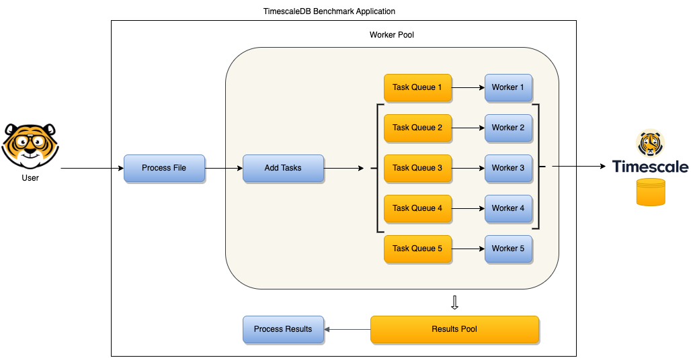

# Timescaledb Benchmark Assignment

# Problem Description
Implement a command line tool that can be used to benchmark SELECT
query performance across multiple workers/clients against a TimescaleDB instance. The tool
should take as its input a CSV file (whose format is specified below) and a flag to specify the
number of concurrent workers. After processing all the queries specified by the parameters in
the CSV file, the tool should output a summary with the following stats:
* of queries processed,
* total processing time across all queries,
* the minimum query time (for a single query),
* the median query time,
* the average query time,
* and the maximum query time.

# Solution Architecture



## 1. Proccess file

## 2. Add tasks


# Prerequisite
Golang  1.19.4<br/>
Docker 20.11.1<br/>

# Technologies
Golang, gocsv, golang-migrate, pq (Pure Go Postgres Driver)<br/>
Docker, git, TimescaleDB<br/>

# Installation

Clone the project:

``` 
git clone git@github.com:ergildo/timescaledb-benchmark-assignment.git

```


